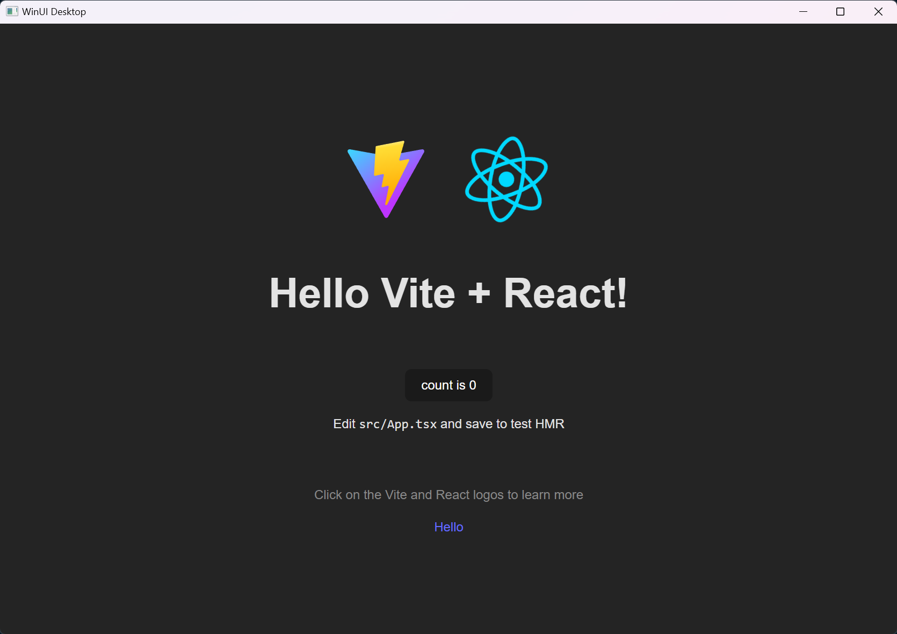

# WinUI3.React
This is a scaffold project that allows you to run a WinUI3 application as the
host of React web app.

# Idea
The idea is pretty simple - the WinUI3 holds a `WebView2` component with its
source set to a local web server. The web server serves the React app and other
assets.

# Features
- No additional web server process is required. The web server is a part of the
  WinUI3 app.
- React router is supported.
- MSIX packaging is configured. The web app will be bundled into the AppX
  package along with the WinUI3.

# How to use
- Install the prerequisites:
  - [Node.js](https://nodejs.org/en/)
  - [Yarn](https://yarnpkg.com/) (You'll need to change the build script if
    using other package managers such as NPM)
  - [Visual Studio 2022](https://visualstudio.microsoft.com/)
  - [Windows App SDK](https://learn.microsoft.com/en-us/windows/apps/windows-app-sdk/set-up-your-development-environment)
- Clone the repo
- `cd` into the `webapp` folder
- Run `yarn` (or `npm install` if you prefer npm)
- Open the solution in Visual Studio 2022
- For **DEBUGGING**
  - In a terminal process, run `yarn start` (or `npm start`) in the `webapp`
    folder.
  - Press <kbd>F5</kbd> in Visual Studio 2022 to start the app.
- For **RELEASE**
  - ⚠️ **Note**: If you choose NPM over Yarn, please update the
    file `build-webapp.ps1` by changing `yarn build` to `npm run build`.
  - Just run or publish the app as you would normally do. There's no need to
    build the web app manually.
  - You'll notice the web app is built when building the CS project, if you look
    to the build output window.
